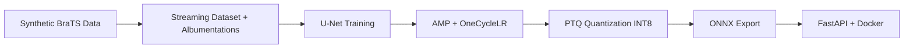

# End-to-End Production Image Segmentation Pipeline

A production-grade **brain tumor segmentation** pipeline built with PyTorch — designed to demonstrate the skills ML engineers use daily: data engineering, optimized training, model compression, and deployment.

> **Resume highlight:** This is not a research notebook. It is a full MLOps-style pipeline from raw data to a Dockerized FastAPI inference server.

## Architecture



## Features

| Component | Implementation |
|-----------|----------------|
| **Data Pipeline** | Custom `Dataset` with on-the-fly disk streaming, Albumentations augmentation, optimized `DataLoader` |
| **Training** | U-Net, Combined CE+Dice loss, **Automatic Mixed Precision (AMP)**, **OneCycleLR** scheduler |
| **Quantization** | Post-Training Static Quantization via `torch.ao.quantization` (INT8) |
| **Deployment** | ONNX export → FastAPI REST API → Docker container |

## Quick Start

### 1. Install dependencies

```bash
python -m venv .venv
.venv\Scripts\activate        # Windows
# source .venv/bin/activate   # Linux/macOS
pip install -r requirements.txt
```

### 2. Run the full pipeline

```bash
python scripts/run_pipeline.py --epochs 5
```

This executes: **generate data → train → quantize → export ONNX**

### 3. Start the inference API

```bash
python scripts/serve.py
```

Open [http://localhost:8000/docs](http://localhost:8000/docs) for interactive Swagger UI.

### 4. Docker deployment

```bash
docker compose up --build
```

## API Endpoints

| Method | Endpoint | Description |
|--------|----------|-------------|
| `GET` | `/health` | Service health check |
| `POST` | `/predict` | Upload MRI image → JSON with tumor ratio & latency |
| `POST` | `/predict/mask` | Upload MRI image → PNG segmentation mask |

**Example (curl):**

```bash
curl -X POST "http://localhost:8000/predict" \
  -F "file=@data/processed/images/sample_0000.png"
```

## Project Structure

```
├── configs/default.yaml       # Central configuration
├── scripts/
│   ├── generate_data.py       # Synthetic BraTS-style data
│   ├── train.py               # AMP training loop
│   ├── quantize.py            # PTQ INT8 compression
│   ├── export_onnx.py         # ONNX export
│   ├── serve.py               # FastAPI server
│   └── run_pipeline.py        # End-to-end runner
├── src/
│   ├── data/                  # Dataset, transforms, synthetic generator
│   ├── models/                # U-Net architecture
│   ├── training/              # Trainer, losses, metrics
│   ├── optimization/          # Quantization engine
│   └── deployment/            # ONNX export + FastAPI
├── Dockerfile
└── docker-compose.yml
```

## Using Real Data (BraTS / Custom)

Place your data in this layout:

```
data/processed/
├── images/
│   ├── case_001.png
│   └── ...
└── masks/
    ├── case_001.png
    └── ...
```

Then run `python scripts/train.py`. The `SegmentationDataset` streams from disk — no in-memory loading.

## Configuration

Edit `configs/default.yaml` to tune:

- `data.batch_size`, `data.num_workers`, `data.image_size`
- `training.amp`, `training.onecycle.*`
- `quantization.calibration_samples`
- `deployment.port`

## Tech Stack

- **PyTorch 2.x** — training, AMP, quantization
- **Albumentations** — medical image augmentation
- **ONNX + ONNX Runtime** — portable inference
- **FastAPI + Uvicorn** — production API
- **Docker** — containerized deployment

## License

MIT
