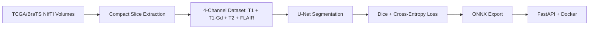

# End-to-End Brain Tumor Segmentation Pipeline

Production-style PyTorch project for brain tumor segmentation. The repository supports two paths:

- A small synthetic demo path for quick CI/local runs.
- A stronger TCGA/BraTS-style path using real pre-operative MRI NIfTI volumes with expert segmentation masks.

> Portfolio angle: this is not only model training. It covers data preparation, PyTorch training, metrics, quantization, ONNX export, FastAPI serving, and Docker deployment.

## Architecture



## What The Model Predicts

The model performs binary semantic segmentation:

- Class 0: background / non-tumor
- Class 1: tumor region

It predicts a mask, then the API reports `tumor_pixel_ratio`. A simple `tumor_detected` flag is derived by thresholding that ratio, but this is a portfolio/demo decision rule, not a clinical diagnosis.

## Quick Synthetic Demo

```bash
python -m venv .venv
.venv\Scripts\activate
pip install -r requirements.txt
python scripts/run_pipeline.py --epochs 5
```

## TCGA/BraTS Real-Data Workflow

Expected raw folder:

```text
data/Pre-operative_TCGA_GBM_NIfTI_and_Segmentations/
  TCGA-02-0006/
    *_t1.nii.gz
    *_t1Gd.nii.gz
    *_t2.nii.gz
    *_flair.nii.gz
    *_GlistrBoost_ManuallyCorrected.nii.gz
```

Prepare a compact portfolio-sized subset:

```bash
python scripts/prepare_brats.py --config configs/brats.yaml --overwrite
```

This creates:

```text
data/BraTS/
  images/*.npy      # 4-channel slices: T1, T1-Gd, T2, FLAIR
  masks/*.png       # binary tumor masks
  previews/*.png    # FLAIR previews for visual checks
  manifest.json
  summary.json
```

Train on the compact real-data subset:

```bash
python scripts/train.py --config configs/brats.yaml --epochs 8
python scripts/export_onnx.py --config configs/brats.yaml
python scripts/serve.py --config configs/brats.yaml
```

## API Endpoints

| Method | Endpoint | Output |
| --- | --- | --- |
| `GET` | `/health` | Model readiness and channel count |
| `POST` | `/predict` | Single-image demo prediction JSON |
| `POST` | `/predict/mask` | Single-image demo mask PNG |
| `POST` | `/predict/multimodal` | Real 4-modality prediction JSON |
| `POST` | `/predict/multimodal/mask` | Real 4-modality mask PNG |

For the real BraTS model, use `/predict/multimodal` with four files named `t1`, `t1gd`, `t2`, and `flair`.

## Metrics

Training reports:

- Dice score: overlap quality, primary segmentation metric.
- IoU score: intersection over union.
- Combined loss: `0.5 * CrossEntropyLoss + 0.5 * DiceLoss`.

## Project Structure

```text
configs/
  default.yaml       # synthetic demo config
  brats.yaml         # real TCGA/BraTS config
scripts/
  prepare_brats.py   # compact real-data extraction
  generate_data.py
  train.py
  quantize.py
  export_onnx.py
  serve.py
  run_pipeline.py
src/
  data/
  models/
  training/
  optimization/
  deployment/
```

## Notes

The downloaded paper figure JPGs are useful for understanding MRI modalities and labels, but they are not suitable training data. The real training data is the NIfTI volume set with aligned modalities and segmentation masks.

Medical disclaimer: this is a portfolio/research engineering project, not a clinically validated diagnostic product.
